# Exno:1
Data Cleaning Process

# AIM
To read the given data and perform data cleaning and save the cleaned data to a file.

# Explanation
Data cleaning is the process of preparing data for analysis by removing or modifying data that is incorrect ,incompleted , irrelevant , duplicated or improperly formatted. Data cleaning is not simply about erasing data ,but rather finding a way to maximize datasets accuracy without necessarily deleting the information.

# Algorithm
STEP 1: Read the given Data

STEP 2: Get the information about the data

STEP 3: Remove the null values from the data

STEP 4: Save the Clean data to the file

STEP 5: Remove outliers using IQR

STEP 6: Use zscore of to remove outliers

# Coding :
## Developed by : YUVARAJ.S
## Register Number : 212222240119
## Data Cleaning 
```py
import pandas as pd
import numpy as np
data=pd.read_csv("SAMPLEIDS.csv")
data.head(2)
data.tail(2)
data.info()
data.describe()
data.isnull().sum()
data.fillna(data.mean(), inplace=True)
data['GENDER'].fillna('Unknown', inplace=True)
data['ADDRESS'].fillna('Unknown', inplace=True)
data['NAME'].fillna('Unknown', inplace=True)
data.head(5)
```
##  Outlier Detection and Removal
```py
import pandas as pd
import numpy as np
data2=pd.read_csv("iris.csv")
data2.head(2)
data2.tail(2)
data2.isnull().sum()
data2.info()
data2.duplicated()
data2.describe()
import seaborn as sns
import matplotlib.pyplot as plt
sns.boxplot(y="petal_length",data=data2)
```
# Output :
## Data Cleaning
### Before Cleaning :
### Head :
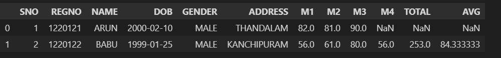
### Tail : 
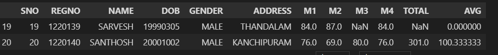
### Data Info :
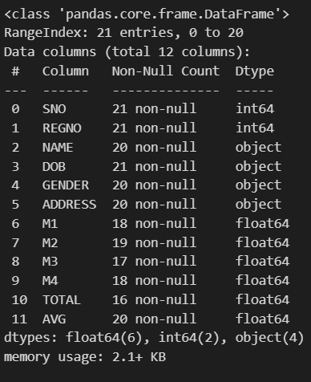
### Data Description :
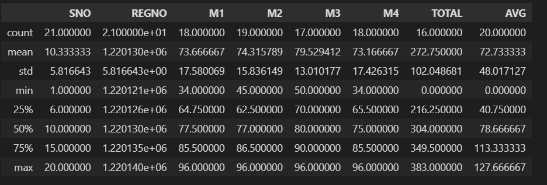
### Null values : 
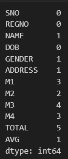
## After Cleaning :
### Null Values :
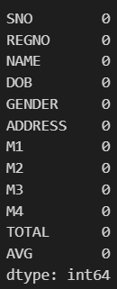
### Head :
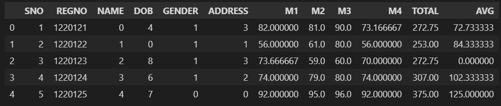
## Outlier Detection and Removal
### Head :
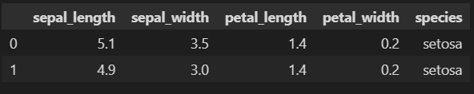
### Tail :
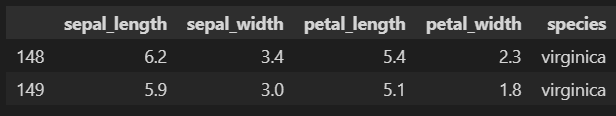
### Null Values :
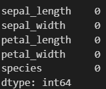
### Data Info :
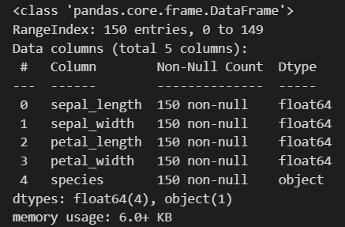
### Data Duplication :
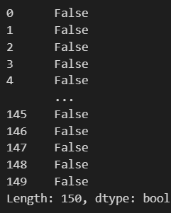
### Data Description :
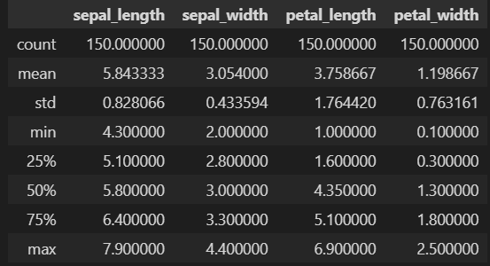
### Plot :
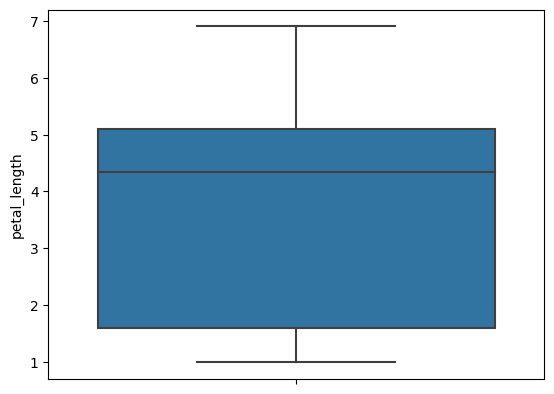
# Result
The Output for Data cleaning and Outlier Detection and Removal are successfully executed.